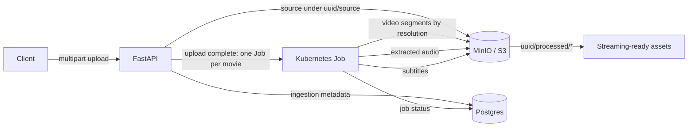

# ott-platform-ingestion-pipeline

Ingestion pipeline for large video files on an OTT platform. It accepts a source
video over HTTP, streams it into object storage as a resumable multipart upload,
and keeps the object laid out so that transcoded renditions, extracted audio and
subtitles can live alongside the original.

The long-term goal is a Netflix-style ingestion path: upload once, then fan out
into per-resolution segments that are ready for streaming.

## High-level design



Upload lands in object storage as the source file. When that finishes, the API
records the ingest in Postgres and creates **one Kubernetes Job per movie**.
The Job runs ffmpeg (renditions, audio, subtitles) under the same UUID, then
updates job status. Volume is small (a handful of titles per day), so the API
talks to the Kubernetes API directly after the multipart upload completes.
Postgres remains the source of truth for the ingest.

## Status

Implemented today:

- Multipart upload of `.mp4` / `.mkv` files into an S3-compatible bucket
- Resuming an interrupted upload by replaying the same file with its `upload_id`
- Inspecting and aborting in-flight multipart uploads
- Creating one Kubernetes Job per movie when an upload completes (`K8S_ENABLED`)
- A worker image that transcodes HLS renditions, extracts audio, and dumps
  subtitle tracks back under `<uuid>/processed/`

Planned, not built yet:

- Persisting ingestion metadata in Postgres (SQLAlchemy / psycopg are already
  in the project, but nothing writes to the database)

## Tech stack

FastAPI, boto3 against MinIO (S3-compatible locally, S3 in production), Postgres,
Kubernetes Jobs for processing, and uv for dependency management. Python 3.12 or
newer is required.

## Storage layout

A new upload gets a generated UUID prefix and the source object is written to:

```
<uuid>/source.<ext>
```

Derived outputs will be written under the same prefix, e.g. `<uuid>/processed/…`,
so everything produced from one ingest stays addressable by a single ID. A caller
that wants control over placement can pass an explicit `key` instead.

## Getting started

Start MinIO:

```bash
docker compose up -d
```

MinIO's console is at http://localhost:9001 (`minioadmin` / `minioadmin`). Create
the bucket named in `S3_BUCKET` before uploading — the service does not create it.

Create a `.env` file in the repository root:

```bash
S3_ENDPOINT_URL="http://localhost:9000"
S3_ACCESS_KEY="minioadmin"
S3_SECRET_KEY="minioadmin"
S3_BUCKET="videos"
S3_REGION="us-east-1"
PART_SIZE_BYTES=8388608
K8S_ENABLED=false
```

Install dependencies and run the API:

```bash
uv sync
uv run uvicorn app.main:app --reload
```

The service listens on http://localhost:8000 and redirects `/` to the interactive
docs at `/docs`.

## Configuration

| Variable | Required | Default | Description |
| --- | --- | --- | --- |
| `S3_ENDPOINT_URL` | yes | — | S3 or MinIO endpoint. An `http`/`https` value switches boto3 to path-style addressing. |
| `S3_ACCESS_KEY` | yes | — | Access key. |
| `S3_SECRET_KEY` | yes | — | Secret key. |
| `S3_REGION` | yes | — | Region name. |
| `S3_BUCKET` | yes | — | Destination bucket, which must already exist. |
| `PART_SIZE_BYTES` | yes | — | Size of each multipart chunk in bytes. Local example uses `8388608` (8 MiB); raise this for larger files if you want fewer parts. |
| `K8S_ENABLED` | no | `false` | When `true`, create a Kubernetes Job after a successful upload. Docker Compose leaves this off (no kube API). |
| `K8S_NAMESPACE` | no | `default` | Namespace where ingest Jobs are created. |
| `K8S_WORKER_IMAGE` | no | `ingest-worker:latest` | Image the Job runs (`worker/Dockerfile`). |

## API

All routes are served under `/api/v1`.

### `POST /upload`

Multipart form upload of a single `file`. The filename extension must be `mp4` or
`mkv`. Optional query parameters:

- `key` — target object key; defaults to `<uuid>/source.<ext>`
- `upload_id` — resume an existing multipart upload instead of starting one

The file is read in `PART_SIZE_BYTES` chunks and each chunk is sent as a part. On
success the multipart upload is completed. If `K8S_ENABLED` is true, the API
then creates a Job named `ingest-<uuid>` that downloads the source object and
writes derivatives under `<uuid>/processed/`:

- HLS video ladders at 1080p / 720p / 480p (skips rungs taller than the source)
- Per-audio-stream AAC (`.m4a`) and MP3
- Embedded subtitle streams as WebVTT

The response returns the `upload_id`, `key`, `parts_uploaded`, and `job_name`
(or `null` when Jobs are disabled). If the object is stored but Job creation
fails, the response is a `502` with the same `key` so processing can be retried
without re-uploading.

Build and load the worker image into the cluster before enabling Jobs:

```bash
docker build -t ingest-worker:latest -f worker/Dockerfile worker
kubectl apply -f k8s/rbac.yaml
```

The API Deployment must use the `ingestion-api` ServiceAccount from that
manifest (or an equivalent that can `create`/`get` Jobs).

If a storage error interrupts the transfer, the response is a `502` whose detail
carries the `upload_id`, `key`, and the number of parts that made it. Retrying
with the same file plus that `key` and `upload_id` seeks past the already-uploaded
parts and continues from there.

```bash
curl -X POST "http://localhost:8000/api/v1/upload" \
  -F "file=@/path/to/movie.mp4"
```

### `GET /status`

Lists the parts already uploaded for a given `key` and `upload_id`.

```bash
curl "http://localhost:8000/api/v1/status?key=<uuid>/source.mp4&upload_id=<id>"
```

### `DELETE /delete_all_parts`

Aborts every in-flight multipart upload in the bucket and discards their parts.
This is a cleanup helper for development; it does not touch completed objects.

## Project layout

```
app/
  main.py            FastAPI app and router wiring
  settings.py        Pydantic settings loaded from .env
  k8s.py             Create a Kubernetes ingest Job
  api/v1/uploads.py  Upload, status, and cleanup endpoints
worker/
  Dockerfile         ffmpeg + boto3 image used by the Job
  transcode.py       Download, transcode, upload processed assets
k8s/rbac.yaml        ServiceAccount/Role so the API can create Jobs
docker-compose.yml   MinIO for local development
```

## License

See [LICENSE](LICENSE).
