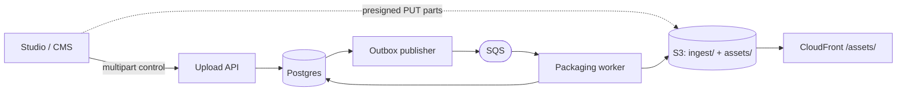

# ott-platform-ingestion-pipeline

Content ingest and packaging for the OTT platform. Studios or CMS operators
upload **feature-length mezzanines** (multi-GB to ~100 GB). This service never
buffers the file: the API is a control plane, parts go straight to S3, then a
leased worker packages **HLS CMAF** (video ladder, audio groups, subtitles) for
a single CloudFront origin.

Playback, catalog, entitlements, and DRM license servers are out of scope.

**Status:** design phase. `main.py` is a stub; target architecture is in
[docs/](docs/Home.md).

## How it works

1. Client starts multipart upload; API returns presigned part URLs.
2. Client PUTs parts to `ingest/{asset_id}/source`. Complete is idempotent;
   size (and optional checksum) is verified with `HeadObject`.
3. API writes `queued` and an **outbox** row in one transaction. A publisher
   process pushes `video.upload.completed` to **SQS**.
4. A worker leases the asset, encodes a **preview rung** first (`preview_ready`),
   then the rest of the ladder (`ready`). Ack after the DB commit.
5. `GET /v1/assets/{id}` returns a **CloudFront** playlist URL, never a raw S3 key.

## Design defaults

| Aspect | v1 |
|---|---|
| Runtime | Python 3.12, FastAPI on EKS |
| Broker | Amazon SQS (multi-hour jobs) |
| Storage | **One** S3 bucket: `ingest/` (private masters), `assets/` (HLS) |
| CDN | CloudFront origin path `/assets/` only — masters are not origin objects |
| Package | HLS CMAF/fMP4 so DRM can attach later without re-encoding the catalog |
| Encode | FFmpeg on a few large workers; MediaConvert later behind the same worker API |
| Isolation | One lease per `asset_id`; preview URL stays valid while 1080p still encodes |

Do not split video / audio / subs across buckets. Relative playlist URIs need
one host.

## Documentation

| Document | What it covers |
|---|---|
| [Docs index](docs/Home.md) | Map of the notes |
| [High Level Design](docs/HLD.md) | Purpose, architecture, assumptions, open questions |
| [API and data model](docs/api.md) | Multipart control plane, lifecycle, schema |
| [Storage](docs/storage.md) | Bucket prefixes, CloudFront, IAM, lifecycle |
| [Messaging and leases](docs/messaging.md) | Outbox, SQS, claim rules |
| [Packaging](docs/packaging.md) | HLS tree, CMAF, preview rung, encoder I/O |
| [Operations](docs/operations.md) | Deploy, NFRs, failures, takedown, repackage |

Diagrams are Mermaid in Markdown. GitHub renders them natively; VS Code / Cursor
preview needs the `bierner.markdown-mermaid` extension.
