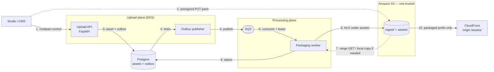

# OTT Ingestion Pipeline — High Level Design

**Service:** `ott-platform-ingestion-pipeline`  
**Status:** Proposed (repo is currently a stub; this HLD is the target architecture)  
**Workload:** Feature-length **VOD movies** (multi-GB to tens/hundreds of GB mezzanines)  
**Stack:** Python 3.12, FastAPI on **EKS**, **Amazon SQS** (v1 broker), **one Amazon S3 bucket**, CloudFront, FFmpeg (v1) / managed encoder (scale), Postgres

Topic notes: [API](api.md) · [Storage](storage.md) · [Messaging](messaging.md) · [Packaging](packaging.md) · [Operations](operations.md)

---

## Purpose

This microservice is the **content ingest and packaging** boundary of the OTT platform. Studios or CMS operators upload a **movie mezzanine** (not a short clip). The API never buffers the file. After multipart upload completes, a worker packages it for adaptive streaming:

- ABR **video HLS** (segmented renditions)
- Separate **audio HLS** group(s)
- **Complete subtitle files** (embedded tracks and, later, sidecar SRT/VTT)

Playback, catalog, entitlements, and DRM license servers are **out of scope**. They consume packaged objects plus the asset row.

### Why “huge movie” changes the design

A two-hour 1080p/4K master is a different system from a 50 MB trailer:

| Clip-scale assumption | Movie-scale reality |
|---|---|
| Download source to the pod, then encode | Scratch of 50–200+ GB and hours of I/O before the first encoded frame |
| One FFmpeg process for the whole ladder | A crash at 90% wastes hours; need leases, resume, or per-rendition jobs |
| Separate buckets per stream type | HLS `master.m3u8` needs **one CDN origin** or the player breaks on CORS/cookies |
| Trust client `size_bytes` and filename in the key | Odd names and a wrong size can fill the node |
| Broker ack after a few minutes | Consumer timeout vs a 3–8 hour encode is a footgun |
| First-audio-only, embedded subs only | Movies need 5.1, multiple languages, sidecar captions |

This HLD is written for **the movie case**, not as a generic file processor.

---

## Architecture

Dotted edges: **bytes do not go through the API**.

**Upload plane.** Client starts multipart, PUTs parts to S3, completes. Complete is **idempotent**. API writes `queued` **and** an outbox row in one transaction. A **publisher process** (sidecar or dedicated loop — not the HTTP handler) drains the outbox to SQS.

**Processing plane.** Worker **leases** the asset, probes, packages the preview rung, stays `preview_ready` while the rest of the ladder uploads, then `ready`. Ack only after DB commit.

**Storage.** One bucket, two prefixes. CloudFront never origins `ingest/`. See [Storage](storage.md).

### Components

| Component | Responsibility |
|---|---|
| **EKS Upload API** | Initiate / presign / complete / abort / GET asset. Stateless. |
| **Outbox publisher** | Polls `outbox` where `published_at` is null; publishes to SQS; marks published. |
| **S3** | Mezzanine at `ingest/{asset_id}/source`; HLS at `assets/{asset_id}/hls/**`. |
| **CloudFront** | Origin path `/assets/`; OAC. Playlist URLs returned to clients are CF URLs. |
| **Postgres** | Asset row + outbox + lease columns. System of record. |
| **SQS** | Buffer between complete and encode. Visibility timeout aligned with lease heartbeat. |
| **Packaging worker** | Lease, FFmpeg (v1) or AWS MediaConvert later. Same S3 layout either way. |

---

## Design assumptions (movies)

| Parameter | Working assumption (tune with product) |
|---|---|
| Mezzanine size | **Up to 100 GB** v1 hard cap (raise with Transfer Acceleration + larger part size) |
| Duration | 30–180+ minutes |
| Source codecs | H.264/H.265 MP4/MOV first; IMF/ProRes later if needed |
| Delivery | HLS VOD (CMAF/fMP4) to a web/mobile/CTV player |
| Concurrent encodes | **Few** (2–8) not hundreds; movies are CPU-bound, not QPS-bound |
| Time-to-first-playable | **Preview rung** (e.g. 480p or 720p) before the full ladder |
| Source retention | Keep mezzanine until QC sign-off; do not expire on `ready` |
| Broker | **SQS for v1**. RabbitMQ only if it is already the platform broker **and** consumer timeout covers a full movie encode |

Part size: **64–128 MiB** so part count stays well under S3’s 10,000 limit (100 GB / 64 MiB ≈ 1,600 parts).

---

## Goals and non-goals

### Goals

- Reliable upload of **movie-sized** objects (multipart, client-direct, resumable parts).
- API is **control plane only**.
- Packaged HLS on **one origin**, playable without cross-origin playlist hacks.
- Survive API/worker restart without losing an accepted complete.
- **Idempotent, leased** encodes so a 6-hour job is not duplicated.
- Verify size (and optional checksum) after complete; keys never include raw filenames.
- First playable URL stays valid while the rest of the ladder encodes (`preview_ready`).

### Non-goals (v1)

- Live, DVR, just-in-time packaging.
- DRM **license servers** (Widevine/FairPlay). Packaging is still **CMAF** so a later license integration does not force a catalog re-encode. See [Packaging](packaging.md).
- Catalog, seasons, entitlements, player.
- ASR when there is no subtitle track (separate worker).
- IMF / JPEG2000 / HDR10+ / Dolby Vision (v2 encoder).
- Hundreds of parallel encodes (wrong cluster shape).
- Thumbnails / posters (optional later prefix; not packaging).

---

## Implementation mapping

| Area | Module (intended) |
|---|---|
| HTTP | `app/main.py`, `app/api/uploads.py`, `app/api/assets.py` |
| S3 | `app/services/s3.py` |
| Outbox + publisher | `app/services/outbox.py` |
| Queue + lease | `app/services/jobs.py` |
| FFmpeg / MediaConvert | `app/services/media.py` |
| Worker | `app/worker.py` |
| ORM | `app/models/db.py` |
| Local | `docker-compose.yml` (MinIO **one** bucket, SQS-compatible or ElasticMQ) |
| Deploy | Helm: API, publisher, worker, KEDA max-replica cap |

---

## Open questions

1. Hard cap: 50 vs 100 vs 200 GB; Transfer Acceleration for remote studios.
2. Confirm DRM is **not** needed in 12 months — only then consider MPEG-TS instead of CMAF.
3. Self-hosted FFmpeg vs MediaConvert for 1080p vs 4K (same worker interface).
4. Sidecar subtitles and multiple audio languages in v1 vs v1.1.
5. `asset.preview_ready` / `asset.ready` events to catalog vs poll.
6. QC workflow: who may delete or Glacier the mezzanine.
7. 5.1 / Atmos / HDR — encoder product, not just another FFmpeg flag.
8. Two-bucket split if legal requires the CDN origin account to be unable to `GetObject` on masters even with a mis-set origin path. Default stays one bucket.
