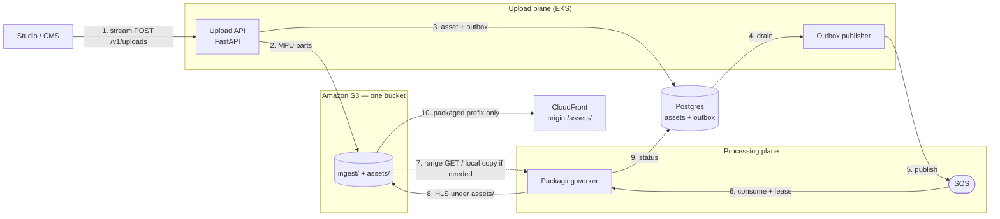
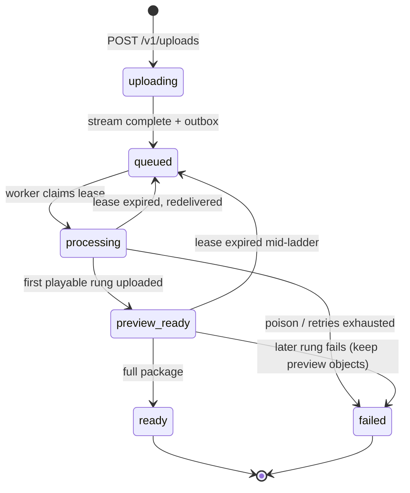

# OTT Ingestion Pipeline — High Level Design

**Service:** `ott-platform-ingestion-pipeline`  
**Status:** Target architecture. Implemented today: S3 multipart via `POST /api/v1/upload` (resume with `upload_id` + `key`). See [API](api.md) and [Development](development.md).  
**Workload:** Feature-length **VOD movies** (multi-GB to tens/hundreds of GB mezzanines)  
**Stack:** Python 3.12, FastAPI on **EKS**, **Amazon SQS** (v1 broker), **one Amazon S3 bucket**, CloudFront, FFmpeg (v1) / managed encoder (scale), Postgres

As-built notes: [API](api.md) · [Development](development.md) · [Storage](storage.md) · [Operations](operations.md)

---

## Purpose

This microservice is the **content ingest and packaging** boundary of the OTT platform. Studios or CMS operators upload a **movie mezzanine** (not a short clip). **Ingest is two APIs:** stream the file through the upload endpoint into S3 multipart; on failure the client retries with the same file and `upload_id`. Status reports parts already stored. After the stream completes, a worker packages it for adaptive streaming:

- ABR **video HLS** (segmented renditions)
- Separate **audio HLS** group(s)
- **Complete subtitle files** (embedded tracks and, later, sidecar SRT/VTT)

Playback, catalog, entitlements, and DRM license servers are **out of scope**. They consume packaged objects plus the asset row.

### Why “huge movie” changes the design

A two-hour 1080p/4K master is a different system from a 50 MB trailer:

| Clip-scale assumption | Movie-scale reality |
|---|---|
| Download source to the pod, then encode | Scratch of 50–200+ GB and hours of I/O before the first encoded frame |
| One FFmpeg process for the whole ladder | A crash at 90% wastes hours; need leases, resume, or per-rendition jobs |
| Separate buckets per stream type | HLS `master.m3u8` needs **one CDN origin** or the player breaks on CORS/cookies |
| Trust client `size_bytes` and filename in the key | Odd names and a wrong size can fill the node |
| Broker ack after a few minutes | Consumer timeout vs a 3–8 hour encode is a footgun |
| First-audio-only, embedded subs only | Movies need 5.1, multiple languages, sidecar captions |

This HLD is written for **the movie case**, not as a generic file processor.

---

## Architecture



Dotted edges: worker reads from S3; playback is CloudFront only.

**Upload plane.** Client streams the file to **`POST /v1/uploads`**. The API creates an MPU, persists `s3_upload_id`, and `upload_part`s in chunks. On failure it **does not abort**; it returns `upload_id`. The client retries the same POST with file + `upload_id`. **`GET /v1/uploads/{upload_id}`** reports parts uploaded. When the stream finishes, complete is **idempotent**. API writes `queued` **and** an outbox row in one transaction. A **publisher process** (sidecar or dedicated loop — not the HTTP handler) drains the outbox to SQS.

**Processing plane.** Worker **leases** the asset, probes, packages the preview rung, stays `preview_ready` while the rest of the ladder uploads, then `ready`. Ack only after DB commit.

**Storage.** One bucket, two prefixes. CloudFront never origins `ingest/`.

```text
ott-media
├── ingest/{asset_id}/source          # private mezzanine
└── assets/{asset_id}/
    └── hls/
        ├── master.m3u8
        ├── video/{360p,480p,720p,1080p}/index.m3u8 + segments
        ├── audio/{lang}_{codec}/index.m3u8 + segments
        └── subtitles/{lang}_{role}.vtt
```

| Prefix | Contents | Writers | Readers |
|---|---|---|---|
| `ingest/{asset_id}/source` | Private mezzanine | API (MPU stream) | Workers only |
| `assets/{asset_id}/hls/**` | master + video + audio + VTT | Workers only | CloudFront OAC |

Keep the mezzanine after pack for QC. Do not expire it on `ready`. CloudFront origin path `/assets/` only; OAC `GetObject` on `assets/*`. Abort incomplete MPUs via S3 lifecycle. Do not use four buckets (relative playlist URIs break).

### Components

| Component | Responsibility |
|---|---|
| **EKS Upload API** | `POST /v1/uploads` (stream + resume via `upload_id`), `GET /v1/uploads/{upload_id}` (parts). Stateless pods; state in Postgres + S3. |
| **Outbox publisher** | Polls `outbox` where `published_at` is null; publishes to SQS; marks published. |
| **S3** | Mezzanine at `ingest/{asset_id}/source`; HLS at `assets/{asset_id}/hls/**`. |
| **CloudFront** | Origin path `/assets/`; OAC. Playlist URLs returned to clients are CF URLs. |
| **Postgres** | Asset row + outbox + lease columns. System of record. |
| **SQS** | Buffer between complete and encode. Visibility timeout aligned with lease heartbeat. |
| **Packaging worker** | Lease, FFmpeg (v1) or AWS MediaConvert later. Same S3 layout either way. |

### HTTP surface

| Method | Path | Role |
|---|---|---|
| `GET` | `/health` | Liveness |
| `GET` | `/ready` | Readiness (Postgres + publisher loop healthy) |
| `POST` | `/v1/uploads` | Stream file; optional `upload_id` to resume; key `ingest/{id}/source` |
| `GET` | `/v1/uploads/{upload_id}` | Parts uploaded for this MPU |
| `GET` | `/v1/assets/{id}` | Packaging status, probe, CloudFront playlist URL |

No public presign / `/parts` / `/complete` / `/abort`. Auth: JWT or mTLS. `GET /v1/assets/{id}` must never return a raw S3 playback URI.

**Statuses:** `uploading` | `queued` | `processing` | `preview_ready` | `ready` | `failed`.



`preview_ready` is a **stable** status. While remaining rungs encode, `GET /v1/assets/{id}` still returns the CloudFront playlist URL.

### Data model

**`assets`:** `id` (UUID; S3 prefix), `filename` (display only — not in the key), `content_type`, `declared_size_bytes`, `actual_size_bytes`, optional `checksum`, `source_bucket`, `source_key` (`ingest/{id}/source`), `s3_upload_id`, `status`, `error`, `lease_owner`, `lease_until`, `probe`, `outputs` (`outputs.playlist_url` is CloudFront), timestamps.

**`outbox`:** `id`, `asset_id`, `event_type`, `payload`, `published_at` (null until broker ack). Unique on `(asset_id, event_type)` for `video.upload.completed`. Create this table when implementing successful complete.

### Messaging and leases

Broker: **Amazon SQS**. Event: `video.upload.completed` only (`asset_id`, `source_bucket`, `source_key`, `size_bytes`, `occurred_at`). Publish via **outbox only** — never from the HTTP handler after a second commit. Publisher polls `published_at IS NULL`. Delivery at-least-once; 1 message per worker; DLQ after N failed leases.

Claim only in-flight rows (`queued`, `processing`, `preview_ready`) with an expired or null lease. Heartbeat `lease_until` and SQS visibility together. Ack after `ready` or `failed` is persisted. Do not steal `ready` / `failed` on lease expiry alone.

### Packaging

One HLS tree under `assets/{asset_id}/hls/`. CMAF/fMP4. Preview rung first, then the rest of the ladder. DRM license servers stay out of this service; CMAF so Widevine/FairPlay can attach later. Encoder: FFmpeg on CPU nodes for 1080p SDR; MediaConvert later behind the same worker interface.

---

## Design assumptions (movies)

| Parameter | Working assumption (tune with product) |
|---|---|
| Mezzanine size | **Up to 100 GB** v1 hard cap (raise with Transfer Acceleration + larger part size) |
| Duration | 30–180+ minutes |
| Source codecs | H.264/H.265 MP4/MOV first; IMF/ProRes later if needed |
| Delivery | HLS VOD (CMAF/fMP4) to a web/mobile/CTV player |
| Concurrent encodes | **Few** (2–8) not hundreds; movies are CPU-bound, not QPS-bound |
| Time-to-first-playable | **Preview rung** (e.g. 480p or 720p) before the full ladder |
| Source retention | Keep mezzanine until QC sign-off; do not expire on `ready` |
| Broker | **SQS for v1**. RabbitMQ only if it is already the platform broker **and** consumer timeout covers a full movie encode |

Part size: **64–128 MiB** so part count stays well under S3’s 10,000 limit (100 GB / 64 MiB ≈ 1,600 parts).

---

## Goals and non-goals

### Goals

- Reliable upload of **movie-sized** objects (S3 multipart streamed through two ingest APIs, resumable via `upload_id`).
- Ingest surface stays **two routes** (upload + status). Packaging status is `GET /v1/assets/{id}`.
- Packaged HLS on **one origin**, playable without cross-origin playlist hacks.
- Survive API/worker restart without losing an accepted complete.
- **Idempotent, leased** encodes so a 6-hour job is not duplicated.
- Verify size (and optional checksum) after complete; keys never include raw filenames.
- First playable URL stays valid while the rest of the ladder encodes (`preview_ready`).

### Non-goals (v1)

- Live, DVR, just-in-time packaging.
- DRM **license servers** (Widevine/FairPlay). Packaging is still **CMAF** so a later license integration does not force a catalog re-encode.
- Catalog, seasons, entitlements, player.
- ASR when there is no subtitle track (separate worker).
- IMF / JPEG2000 / HDR10+ / Dolby Vision (v2 encoder).
- Hundreds of parallel encodes (wrong cluster shape).
- Thumbnails / posters (optional later prefix; not packaging).

---

## Implementation mapping

As-built paths: [Development](development.md). Target modules:

| Area | Module |
|---|---|
| App compose | `app/main.py` |
| Config | `app/settings.py` (`.env` at repo root) |
| HTTP v1 | `app/api/v1/uploads.py`, `app/api/v1/assets.py` |
| Health | `app/api/health.py` (`/health`, `/ready` — not under `/v1`) |
| S3 MPU | `app/services/s3.py` |
| Asset persistence | `app/services/assets.py`, `app/db.py`, `app/models.py` |
| JSON contracts | `app/schemas.py` |
| Outbox + publisher | `outbox` table + `app/publisher.py` (not the request thread) |
| Worker | `worker/` (lease + FFmpeg); later `app/services/media.py` |
| Local | `docker-compose.yml`: MinIO **one** bucket + Postgres; SQS-compatible when publisher exists |
| Deploy | Helm: API, publisher, worker, KEDA max-replica cap |

---

## Open questions

1. Hard cap: 50 vs 100 vs 200 GB; Transfer Acceleration for remote studios.
2. Confirm DRM is **not** needed in 12 months — only then consider MPEG-TS instead of CMAF.
3. Self-hosted FFmpeg vs MediaConvert for 1080p vs 4K (same worker interface).
4. Sidecar subtitles and multiple audio languages in v1 vs v1.1.
5. `asset.preview_ready` / `asset.ready` events to catalog vs poll.
6. QC workflow: who may delete or Glacier the mezzanine.
7. 5.1 / Atmos / HDR — encoder product, not just another FFmpeg flag.
8. Two-bucket split if legal requires the CDN origin account to be unable to `GetObject` on masters even with a mis-set origin path. Default stays one bucket.
