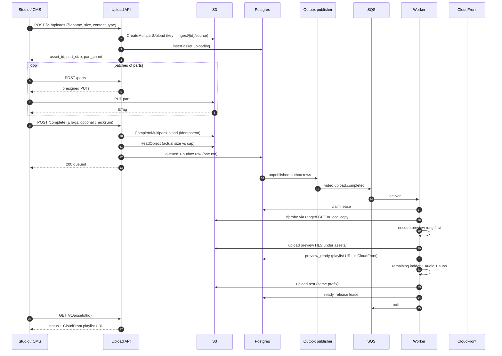
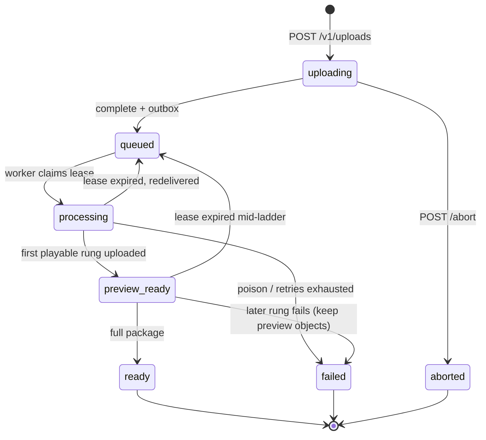

# API and data model

Back to [HLD](HLD.md). Related: [Messaging](messaging.md), [Storage](storage.md).

The upload API is a **control plane**. Bytes never transit the service. Clients PUT parts directly to S3 using short-lived presigned URLs.

## Primary flow

Abort: `POST /v1/uploads/{id}/abort` while `uploading`. Incomplete MPUs that are never aborted are cleaned by an S3 lifecycle rule (days).

**Idempotent complete.** If the client retries `POST /complete` after S3 already finished the MPU, treat it as success: `HeadObject`, ensure `queued` + outbox exist, return the same 200. Do not create a second outbox row for the same asset.

## Asset lifecycle

`preview_ready` is a **stable** status, not a blip. While remaining rungs encode, `GET /v1/assets/{id}` still returns the CloudFront playlist URL. Do not drop back to `processing`.

Lease expiry from `preview_ready` requeues the job; the new worker overwrites deterministic keys and must not delete the preview tree until a replacement preview exists.

## HTTP surface (v1)

| Method | Path | Role |
|---|---|---|
| `GET` | `/health` | Liveness |
| `GET` | `/ready` | Readiness (Postgres + publisher loop healthy) |
| `POST` | `/v1/uploads` | Start MPU + asset |
| `POST` | `/v1/uploads/{id}/parts` | Presign parts |
| `POST` | `/v1/uploads/{id}/complete` | Complete MPU, HeadObject, outbox |
| `POST` | `/v1/uploads/{id}/abort` | Abort MPU |
| `GET` | `/v1/assets/{id}` | Status, probe, **CloudFront** playlist URL |

v1.1: `POST /v1/assets/{id}/subtitles` for sidecar SRT/VTT (movies often ship captions separately). Repackage without re-upload is described in [Operations](operations.md).

**Statuses:** `uploading` | `queued` | `processing` | `preview_ready` | `ready` | `failed` | `aborted`.

Auth: **required** even on the mesh (JWT or mTLS). Presign is a write path into `ingest/`.

`GET /v1/assets/{id}` must never return a raw S3 URI for playback. `outputs.playlist_url` is a CloudFront URL under `/assets/{id}/hls/master.m3u8`.

## Data model

### `assets`

| Field | Notes |
|---|---|
| `id` | UUID; S3 prefix |
| `filename` | Display name only — **not** in the object key |
| `content_type`, `declared_size_bytes`, `actual_size_bytes` | HeadObject after complete |
| `checksum` | Optional client checksum verified after complete |
| `source_bucket`, `source_key` | Bucket + `ingest/{id}/source` (bucket in payload so a later split is config) |
| `s3_upload_id` | While uploading |
| `status`, `error` | Lifecycle |
| `lease_owner`, `lease_until` | Encode claim |
| `probe`, `outputs` | JSON (`outputs.playlist_url` is CloudFront) |
| `created_at`, `updated_at` | UTC |

### `outbox`

`id`, `asset_id`, `payload`, `published_at` (null until broker ack). Unique on `asset_id` for `video.upload.completed` so complete retries cannot double-publish.
