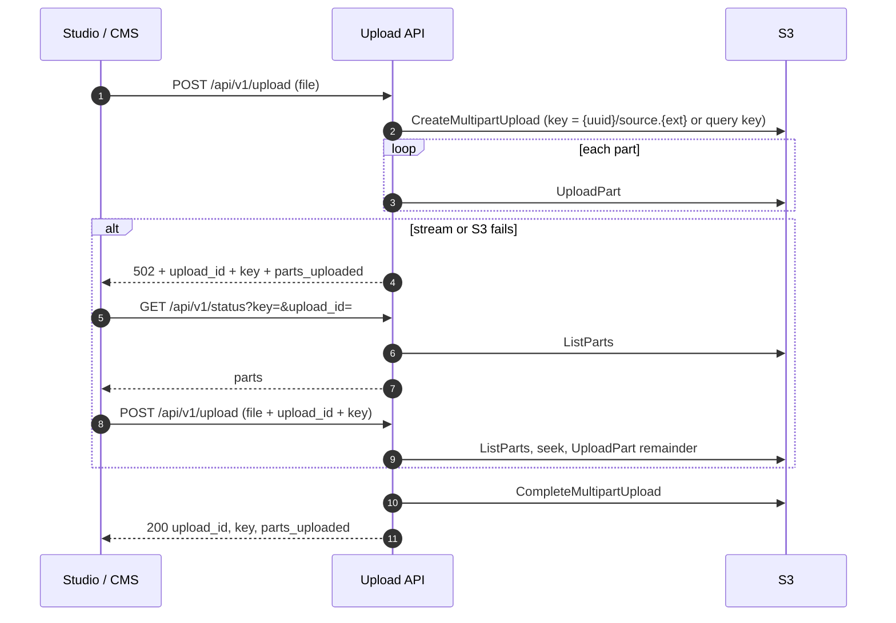

# API

Back to [HLD](HLD.md). Related: [Development](development.md), [Storage](storage.md).

The client streams a mezzanine through FastAPI. The handler writes S3 multipart parts. `upload_id` and `key` are returned to the client and must be sent back on retry. There is no database on this path and no presign flow.

Mounted from `app/api/v1/uploads.py` (prefix `/api/v1`). OpenAPI is at `/docs`. `GET /` redirects there.

| Method | Path | Role |
|---|---|---|
| `POST` | `/api/v1/upload` | Stream the file into S3 multipart. Optional `upload_id` + `key` to resume |
| `GET` | `/api/v1/status` | List parts already on S3 for an in-progress MPU |
| `DELETE` | `/api/v1/delete_all_parts` | Abort **every** in-progress MPU in the bucket |

No auth. Allowed filename suffixes (case-sensitive): **mp4**, **mkv**.

Target ingest contract (Postgres, `/v1`, packaging): [HLD](HLD.md).

### `POST /api/v1/upload`

- Body: `multipart/form-data` with `file`.
- Query (optional): `upload_id` — S3 multipart upload id from a previous failed attempt.
- Query (optional): `key` — S3 object key. Required on resume (must match the first response). If omitted on a new upload, the server uses `{uuid}/source.{suffix}` where `suffix` is the last segment of the filename.
- First call (no `upload_id`): `CreateMultipartUpload`, then `UploadPart` in `PART_SIZE_BYTES` chunks (default 8 MiB). On success: `CompleteMultipartUpload`.
- Resume (with `upload_id` and `key`): `ListParts`, `seek` to `len(parts) * PART_SIZE_BYTES` on the uploaded file, then `UploadPart` for the remainder and complete. The client must retry with the **same file** from the start. The file object must be seekable (FastAPI’s `UploadFile` spool usually is).
- On **S3/network error** during create/list/upload/complete: **do not abort** the MPU. HTTP **502** with `upload_id`, `key`, `parts_uploaded`. Retry the same `POST` with file + `upload_id` + `key`.
- Empty stream (no parts): `AbortMultipartUpload`, HTTP **500** `No parts uploaded`.
- Success **200**: `{ "upload_id", "key", "parts_uploaded" }`.

`upload_id` is the S3 MPU id (string). Resume after an API restart works only if the client still has `upload_id` and `key`.

### `GET /api/v1/status`

Query: `key` (required), `upload_id` (optional but required for a valid `ListParts` call).

Success **200**: `{ "message": "Upload status", "parts": [...] }` from S3 `ListParts`. Failure **502** with the boto exception text.

### `DELETE /api/v1/delete_all_parts`

`ListMultipartUploads` on the bucket, then `AbortMultipartUpload` for each. Success **200**: `{ "message": "All uploads deleted" }`. No auth, no per-object filter.

## Upload flow

Incomplete MPUs can be aborted with `DELETE /api/v1/delete_all_parts`. Completing an MPU that is already completed is not handled: `ListParts` fails and the client gets 502.
