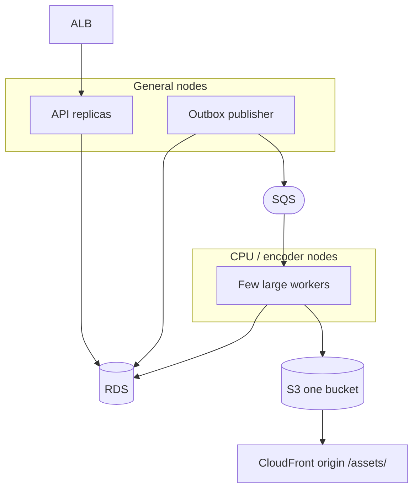

# Operations

Back to [HLD](HLD.md). Related: [Storage](storage.md), [Messaging](messaging.md), [API](api.md).

## Deployment

| Workload | Shape |
|---|---|
| API | Many small pods, HPA on RPS |
| Publisher | One or few replicas; not on the request path |
| Worker | **Few large** pods (or MediaConvert jobs). KEDA on queue depth with a **low max** so you do not spawn 50 FFmpegs |
| Disk | Instance store or large emptyDir **only if** local encode/copy is required |
| Local | MinIO (one bucket) + SQS-compatible queue + API + publisher + one worker; use a **short** test file, not a real master |

## NFRs (proposed)

| Area | Target |
|---|---|
| Max object | 100 GB v1; part size 64–128 MiB |
| Upload | Part retry; abort incomplete MPUs via S3 lifecycle |
| API | Presign/complete p99 &lt; 200 ms excluding S3 |
| Encode | Best-effort; **hours** for a feature 1080p ladder is expected |
| Preview | First playable rung without waiting on 1080p |
| Durability | Mezzanine + packaged in S3; RDS backups; outbox |
| Isolation | One movie per lease; no two FFmpegs on one `asset_id` |
| Security | Auth on API; IRSA; short presign TTL; no filename in keys |

## Failure handling

| Failure | Handling |
|---|---|
| Presign expired | Re-request `/parts` |
| Size over cap after HeadObject | Do not queue; `failed` with clear error |
| Checksum mismatch | Do not queue; `failed` |
| Complete retried | Idempotent; one outbox row |
| Outbox publish lag | Publisher retries; complete already durable |
| Worker death mid-encode | Lease expires → another worker; deterministic keys overwrite |
| Encode longer than visibility timeout | Heartbeat lease **and** SQS visibility |
| Poison file | DLQ + `failed`; keep source for QC |
| No video stream | `failed` |
| No audio / no subs | `ready` with groups omitted |
| Preview ok, ladder fails | Stay `preview_ready` with preview retained; surface error for the failed rungs. Product may later force `failed`. |

## Observability

- Queue age, **lease age**, encode wall time, bytes in/out, FFmpeg exit, DLQ, `preview_ready` vs `ready` lag.
- Log `asset_id`; never log presigned URLs.
- Alert: stuck `processing` or `preview_ready` past lease, DLQ, disk pressure, encode p95 above SLO.

## Security

- JWT or mTLS before any network that can call presign.
- API may presign **`ingest/`** writes only; only workers write **`assets/`**.
- CloudFront OAC cannot `GetObject` on `ingest/`.
- Sanitize `filename` for display; object key is `source`.
- Cap **actual** size, not only declared size.

## Repackage

Operators must be able to rebuild the HLS tree **without** re-uploading the mezzanine (new ladder, sidecar subs, encoder bugfix).

- Source of truth remains `ingest/{asset_id}/source`.
- Enqueue a pack job against an existing `ready` or `failed` asset (v1.1 API). New lease, overwrite `assets/{asset_id}/hls/**`, invalidate CloudFront for `master.m3u8`.
- Do not create a second `asset_id` unless product wants versioning.

## Takedown / delete

- Abort in-flight MPU if `uploading`.
- Delete `ingest/{asset_id}/` and `assets/{asset_id}/` prefixes.
- Invalidate CloudFront for that asset path.
- Mark the row `aborted` or a dedicated `deleted` status; do not leave a live playlist URL.

QC Glacier of the mezzanine is a **prefix lifecycle** plus an operator allow-list — not an automatic side effect of `ready`. See [open questions](HLD.md#open-questions).
